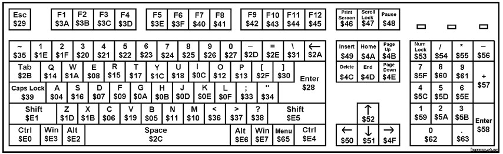

# PicoTerm
Pi Pico VGA Terminal Emulator For RC2014

Once wired to the UART of the RC2014 (or any retro-computer) your get an autonomous system.

__PicoTerm is a terminal emulator__ written specifically for this module. Currently it runs 80 columns by 30 lines in black and white mode. Switching to 40 column colour version will be available shortly. It can use VT100 style escape codes, with support for the following

| Escape sequence             | Description                                              |
|-----------------------------|----------------------------------------------------------|
| \ESC[?25l | Cursor invisible                                                           |
| \ESC[?25h | Cursor visible                                                             |
| \ESC[H    | Move to 0-0                                                                |
| \ESC[s    | Save the cursor position                                                   |
| \ESC[u    | Move cursor to previously saved position                                   |
| \ESC[-Row-;-Col-H | Move to -Row-,-Col-                                                |
| \ESC[0K   | Clear from cursor to the end of the line                                   |
| \ESC[1K   | Clear from the beginning of the current line to the cursor                 |
| \ESC[2K   | Clear the whole line                                                       |
| \ESC[2J   | Clear the screen and move the cursor to 0-0                                |
| \ESC[-n-A | Move the cursor up -n- lines                                               |
| \ESC[-n-B | Move the cursor down -n- lines                                             |
| \ESC[-n-C | Move the cursor forward -n- characters                                     |
| \ESC[-n-D | Move the cursor backward -n- characters                                    |
| \ESC[0m   | normal text (should also set foreground & background colours to normal)    |
| \ESC[7m   | reverse text                                                               |
| \ESC[0J   | clear screen from cursor                                                   |
| \ESC[1J   | clear screen to cursor                                                     |
| \ESC[3J   | same as \ESC[2J                                                            |
| \ESC[nS   | scroll whole page up by n rows (default 1 if n missing)                    |

40 col colour only: (sequence is ignored, no effect in 80 col b/w)

| Escape sequence             | Description                                              |
|-----------------------------|----------------------------------------------------------|
| \ESC[38;5;-n-m | Set foreground colour to -n- (0-255)                                  |
| \ESC[48;5;-n-m | Set background colour to -n- (0-255)                                  |

USB keyboards are supported via a USB OTG adapter – however, not all keyboards currently work. Most cheap generic keyboards seem to work fine, however, the testing sample is still fairly small. Hopefully with more data it will be easier to identify exactly which keyboards are likely to work and which aren’t, or, better still, a simple software fix will get more working.

## How it works
* Textmode version (from v1.1) allows choice of green, amber or white on black, by holding button A, B or C on power-up. (choice is remembered).
* Configuration menu is available via CTRL+SHIFT+M (configuration can be stored in Flash)
* VGA generation starts at power-up
* Pico LED blinks --> no USB device/keyboard attached
* Pico LED off --> USB device/keyboard connected
* VGA display is suspended 1 second when plug-in an USB keyboard

# Release notes
See the file [releases.md](releases.md) .

## Know issues
1. USB keyboard is not detected if already connected at power-up. Disconnect and reconnect it!
2. VGA rendering sometime hangs when connecting a keyboard (rare). Press reset button (on PicoTerm) and try again.
3. Saving the configuration into Flash fails from time to time (rare). Just press reset button (on PicoTerm) and try again.
4. Can only change the color 2 times ( it always hang at the third color change. Suspect memory leak in build_font() ). Just press the reset button and try again.

# Uploading firmware

The Pi Pico uses a UF2 bootloader to appear as a mass storage device so that new firmware can be uploaded to it.  To do this, connect a Micro USB lead between the Pico and your PC/Mac/Laptop/Raspberry Pi/Android Phone.  Then push the BOOTSEL button on the Pico. Whilst holding this down, push and release the RUN button on the VGA board.  (Trust me, This is easier to to than to put in to words!). The Pico will then show up as a drive on your computer.  Simply drag and drop the UF2 firmware on to this drive.  The Pico will automatically reboot and disconnect once this is complete.

# Building firmware from source

It is highly recommended that you follow the Getting Started With Raspberry Pi Pico documentation from the Raspberry Pi Foundation.  In addition to this, you will need to copy pico_sdk_import.cmake, pico_extras_import.cmake and font.h from pico-sdk, pico-extras and pico-playground\scanvideo\textmode.

Please follow the [compiling](compiling.md) for details about setting-up compile chain and build the picoterm for all the keyboard layouts. Issuing a `make all` will build all the layout at once.

## About debugging

Need to debug and troubleshoot? See the [debug.md](debug.md) document which describes the picoterm _debug uart_.

# Adding a keyboard layout

To add a keyboard layout, you must refer to this following picture (sourced from [this article from Vasily Rubashka, Ukraine , Sergey Shilov, Russia](https://www.mcselec.com/index.php?option=com_content&task=view&id=322)) to identify the keycode with the keys position.

Then:
1. define the __LOCALISE_xx__ layout constant (eg: `LOCALISE_FR` for French keyboard)
2. Update the `CMakeLists.txt` and append a new __picoterm_xx__ executable for the new layout (eg: `picoterm_FR`). Just follow the `picoterm_FR` as an example and repeat the operations.
3. Code a new section in the `pmhid.h` file for the new __LOCALISE_xx__ layout. This should be obvious.
4. `cmake ..` need to be issued once to be able to build the new executable __picoterm_xx__ .
5. From now, the picoterm can be compiled for the new layout with `make picoterm_xx` (eg: `make picoterm_FR`).

Voila!
