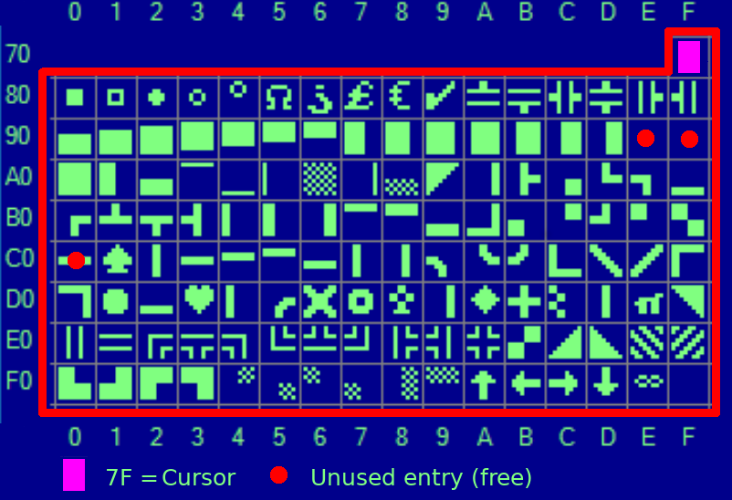
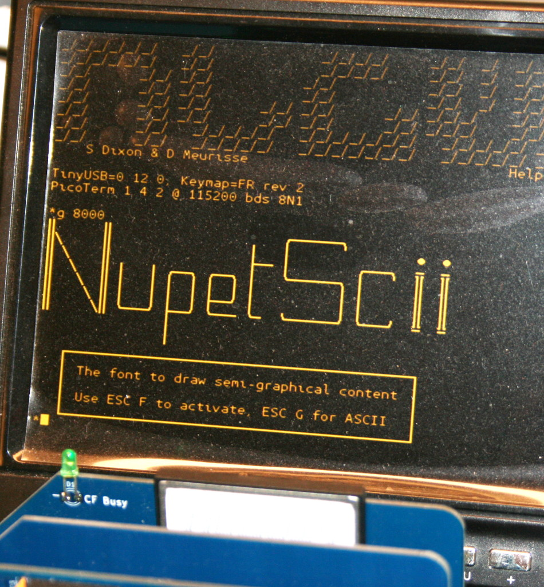

# PicoTerm
Pi Pico VGA Terminal Emulator For RC2014 supporting several keyboard layout.

Once wired to the UART of the RC2014 (or any retro-computer) your get an autonomous system.

__PicoTerm is a terminal emulator__ written specifically for this module. Currently it runs 80 columns by 30 lines in black and white mode. Switching to 40 column colour version will be available shortly. It can use VT100 style escape codes, with support for the following

| Escape sequence             | Description                                              | [Test name](test-suite/readme.md)  |
|-----------------------------|----------------------------------------------------------|--------------------|
| \ESC[?2l	| Enter VT52 mode                                                            | cursor_move_vt52   |
| \ESC[?7l	| Wraparound OFF                                                             | no_warp            |
| \ESC[?7h	| Wraparound ON                                                              | do_warp            |
| \ESC[?12l	| Text Cursor Disable Blinking (but still visible)                           | cursor_blink       |
| \ESC[?12h	| Text Cursor Enable Blinking                                                | cursor_blink       |
| \ESC[?25l | Cursor invisible                                                           | cursor_hide        |
| \ESC[?25h | Cursor visible                                                             | cursor_hide        |
| \ESC[?47l | Secondary screen buffer: Restore screen (but not cursor). Also with \ESC[?1047l, \ESC[?1049l for Linux | screen_save, screen_save_1047 screen_save_1049 |
| \ESC[?47h | Secondary screen buffer: Save screen. Also with \ESC[?1047h, \ESC[?1049h for Linux                     | screen_save, screen_save_1047 screen_save_1049 |
| \ESC[H    | Move to 0-0                                                                | clearscr           |
| \ESCc     | reset settings                                                             | reset_settings     |
| \ESC[0c   | Ask VT100 ID                                                               | vt100_status       |
| \ESC[s    | Save the cursor position                                                   | cursor_save        |
| \ESC[u    | Move cursor to previously saved position                                   | cursor_save        |
| \ESC[*{row}*;*{col}*H | Move to *{row}*,*{col}*                                        | move_at_2_3        |
| \ESC[*{row}*;*{col}*f | Move to *{row}*,*{col}*  (same as H)                           | move_at_2_3_v2     |
| \ESC[0K   | Clear from cursor to the end of the line                                   | clear_to_eol       |
| \ESC[1K   | Clear from the beginning of the current line to the cursor                 | clear_from_bol     |
| \ESC[2K   | Clear the whole line                                                       | clear_line         |
| \ESC[0J	  | Clear the screen from cursor until end of screen                           | clearscr           |
| \ESC[1J   | clear screen to cursor                                                     | clear_to_cursor    |
| \ESC[2J   | Clear the screen and move the cursor to 0-0                                | clear              |
| \ESC[3J   | same as \ESC[2J __[Not accordinly to that documentation](https://gist.github.com/fnky/458719343aabd01cfb17a3a4f7296797)__    |                    |
| \ESC[*{n}*@	| Insert *{n}* Space Characters                                            | char_insert        |
| \ESC[*{n}*P	| Delete *{n}* Characters, shifting in space characters The end-of-line shift left of *{n}* chars from cursor position | char_delete, char_delete80 |
| \ESC[*{n}*X	| Erase *{n}* Characters on the right of cursor (cursor position included), erased char are replace with space character.   | char_erase, char_erase80   |
| \ESC[*{n}*A | Move the cursor up *{n}* lines                                           | cursor_move        |
| \ESC[*{n}*B | Move the cursor down *{n}* lines                                         | cursor_move        |
| \ESC[*{n}*C | Move the cursor forward *{n}* characters                                 | cursor_move        |
| \ESC[*{n}*D | Move the cursor backward *{n}* characters                                | cursor_move        |
| \ESC[*{n}*d	| Move the cursor to an absolute *{n}* line                                | cursor_at_line     |
| \ESC[*{n}*E	| Move the cursor to beginning of next line, *{n}* lines down              | cursor_down_bol    |
| \ESC[*{n}*F	| Move the cursor to beginning of previous line, *{n}* lines up            | cursor_up_bol      |
| \ESC[*{n}*G	| Move the cursor to column *{n}*                                          | cursor_at_col      |
| \ESC[0m     | normal text (should also set foreground & background colours to normal)  | back_to_normal     |
| \ESC[5m	  | Blink ON                                                                   | blink              |
| \ESC[7m   | reverse text                                                               | reverse            |
| \ESC[25m	| Blink OFF                                                                  | blink              |
| \ESC[27m	| reset inverse/reverse mode                                                 | reverse            |
| \ESC[0J   | clear screen from cursor                                                   | clearscr           |
| \ESC[nS   | scroll whole page up by n rows (default 1 if n missing). No cursor move. (Look for "CSI Ps S" in [XTerm Control Sequences](https://invisible-island.net/xterm/ctlseqs/ctlseqs.html#h2-Functions-using-CSI-_-ordered-by-the-final-character_s), VT420)  | scroll_up, scroll_up3 |
| \ESC[*{n}*T	| scroll down *{n}* lines (default 1 if n missing). No cursor move. (Look for "CSI Ps T" in [XTerm Control Sequences](https://invisible-island.net/xterm/ctlseqs/ctlseqs.html#h2-Functions-using-CSI-_-ordered-by-the-final-character_s), VT420)  | scroll_down, scroll_down3 |
| \ESCF     | Enter graphic mode - special graphic charset, NuPetScii. (vt52, vt100)  [Sample](docs/using-nupetscii.md). |  nupetscii, nupetscii2   |
| \ESCG     | Exit graphic mode - ASCII charset (vt52, vt100)                            |  ascii             |

VT52 escape (available onb VT100 **but is currently VT52 only**)

| Escape sequence             | Description                                              | [Test name](test-suite/readme.md)  |
|-----------------------------|----------------------------------------------------------|--------------------|
| \ESCA       | Move the cursor up 1 line (vt52, not vt100)                              | cursor_move_vt52   |
| \ESCB       | Move the cursor down 1 line (vt52, not vt100)                            | cursor_move_vt52   |
| \ESCC       | Move the cursor right 1 col (vt52, not vt100)                            | cursor_move_vt52   |
| \ESCD       | Move the cursor left 1 col (vt52, not vt100)                             | cursor_move_vt52   |
| \ESCH       | Move to 0-0 (vt52, not vt100)                                            | home_vt52          |
| \ESCI       | Reverse Line-Feed (vt52, not vt100)                                      | reverse_lf_vt52    |
| \ESCJ	      | Clear the screen from cursor until end of screen (vt52, not vt100)       | clear_eos_vt52     |
| \ESCK	      | Clear from cursor until end of line (vt52, not vt100)                    | clear_eol_vt52     |
| \ESC<	      | Enter vt100 mode                                                         | cursor_move_vt52   |
| \ESCZ	      | Identify/return Terminal ID (DECID is 0x9a). (vt52, not vt100) **defect**| term_id_vt52       |
| \ESC[Z	    | Identify/return Terminal ID (DECID is 0x9a). (vt52, not vt100)           | term_id2_vt52      |

Cursor Style

| Escape sequence             | Description                                              | [Test name](test-suite/readme.md)  |
|-----------------------------|----------------------------------------------------------|--------------------|
| \ESC[0 q	| Default cursor shape configured by the user                                | cursor_style       |
| \ESC[1 q	| Blinking block cursor shape                                                | cursor_style       |
| \ESC[2 q	| Steady block cursor shape                                                  | cursor_style       |
| \ESC[3 q	| Blinking underline cursor shape                                            | cursor_style       |
| \ESC[4 q	| Steady underline cursor shape                                              | cursor_style       |
| \ESC[5 q	| Blinking bar cursor shape                                                  | cursor_style       |
| \ESC[6 q	| Steady bar cursor shape                                                    | cursor_style       |

DEC Line Drawing

| Escape sequence             | Description                                              | [Test name](test-suite/readme.md)  |
|-----------------------------|----------------------------------------------------------|--------------------|
| \ESC(0   | Enables DEC Line Drawing Mode - single line                                 | dec_lines          |
| \ESC(2   | Enables DEC Line Drawing Mode - double line                                 | dec_lines          |
| \ESC(B   | Enables ASCII Mode (Default)                                                | dec_lines          |

| Hex     | ASCII    | DEC Line Drawing      |
|---------|----------|-----------------------|
| 0x6a    | j        | ┘                     |
| 0x6b    | k        | ┐                     |
| 0x6c    | l        | ┌                     |
| 0x6d    | m        | └                     |
| 0x6e    | n        | ┼                     |
| 0x71    | q        | ─                     |
| 0x74    | t        | ├                     |
| 0x75    | u        | ┤                     |
| 0x76    | v        | ┴                     |
| 0x77    | w        | ┬                     |
| 0x78    | x        | │                     |

40 col colour only: (sequence is ignored, no effect in 80 col b/w)

| Escape sequence             | Description                                              |
|-----------------------------|----------------------------------------------------------|
| \ESC[38;5;*{n}*m | Set foreground colour to *{n}* (0-255)                              |
| \ESC[48;5;*{n}*m | Set background colour to *{n}* (0-255)                              |

USB keyboards are supported via a USB OTG adapter – however, not all keyboards currently work. Most cheap generic keyboards seem to work fine, however, the testing sample is still fairly small. Hopefully with more data it will be easier to identify exactly which keyboards are likely to work and which aren’t, or, better still, a simple software fix will get more working.

PicoTerm provides:
* VT100 ASCII: default, the 8th bit is for reverse video character.
* [advanced NuPetSCII charset](nupetscii-font/readme.md): that charset defines entry from 128 to 255 to display semi-graphical characters (like Commodore C64 or CodePage 437).

Big thanks to Tom Wilson and its [Character-Editor](https://github.com/tomxp411/Character-Editor) for autorising the NuPet ASCII charset inclusion.

If you are interested in Drawing & Rendering NuPetScii ressource in PicoTerm you can read:
* [NupetScii-Font readme](nupetscii-font/readme.md): explains how to create ressource and extract data
* [Using NupetScii readme](docs/using-nupetscii.md): some RC2014 assembly & codes related to NuPetScii usage on RC2014.

## How PicoTerm works
* Textmode version (from v1.1) allows choice of green, amber or white on black, by holding button A, B or C on power-up. (choice is remembered).
* Configuration menu is available via CTRL+SHIFT+M (configuration can be stored in Flash)
* VGA generation starts at power-up
* Pico LED blinks --> no USB device/keyboard attached
* Pico LED off --> USB device/keyboard connected
* VGA display is suspended 1 second when plug-in an USB keyboard

## Uploading firmware

The Pi Pico uses a UF2 bootloader to appear as a mass storage device so that new firmware can be uploaded to it.  To do this, connect a Micro USB lead between the Pico and your PC/Mac/Laptop/Raspberry Pi/Android Phone.  Then push the BOOTSEL button on the Pico. Whilst holding this down, push and release the RUN button on the VGA board.  (Trust me, This is easier to to than to put in to words!). The Pico will then show up as a drive on your computer.  Simply drag and drop the UF2 firmware on to this drive.  The Pico will automatically reboot and disconnect once this is complete.

# Release notes
See the file [releases.md](releases.md) .

## Know issues
1. USB keyboard is not detected if already connected at power-up. Disconnect and reconnect it! __Hardware workaround available see the [picoterm-port](docs/picoterm-port.md)__.
2. VGA rendering sometime hangs when connecting a keyboard (rare). Press reset button (on PicoTerm) and try again.
3. Saving the configuration into Flash fails from time to time (rare). Just press reset button (on PicoTerm) and try again.

# PicoTerm documentation

The picoterm projet contains a wide variety of documentation and ressources about the software.

| Document                    | Description                                              |
|-----------------------------|----------------------------------------------------------|
| [Release notes](releases.md)       | History of changes                                |
| [NupetScii](nupetscii-font/readme.md) | Discovering the NuppetScii alternative font and coding. Discover Playscii a software to draw screen with NuPetScii. |
| [Using-NupetScii](docs/_static/using-nupetscii.md) | How to activate NuPetScii from RC2014. |
| [Compiling](compiling.md)          | Building firmware from source How to setup the compilation environment to compile PicoTerm on your computer |
| [Debug](docs/debug.md)             | Poor man serial debugger for PicoTerm. Need to debug and troubleshoot? This document describes the picoterm _debug uart_. |
| [Add keyboard layout](docs/add-keyboard-layout) | How to add a new keyboard layout to PicoTerm.                    |
| [test-suite](test-suite/readme.md) | How to test ESC sequence support of Picoterm and how to expand the tests.     |
| [picoterm-conn](docs/picoterm-conn.md)  | Details about the PicoTerm expansion connector and available GPIOs.      |
| [Resources](docs/resources.md)     | Useful ressource link used during development of PicoTerm                     |
