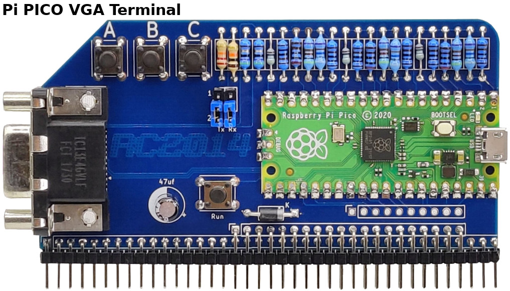

# PicoTerm - VGA Terminal for RP2014

__PicoTerm is a VGA terminal emulator__ with several keyboard layout written specifically for the [RC2014 Pi Pico VGA Terminal](https://rc2014.co.uk/modules/pi-pico-vga-terminal/). It runs 80 columns by 30 lines in monochrome mode. It also exists in basic 40 columns colour version as a separate firmware.

Once wired to the UART of the RC2014 (or any retro-computer) your get an autonomous system.

## PicoTerm features

PicoTerm offers the following features:
* Super easy firmware upgrade (see [firmware upgrading](docs/firmware-upgrade.md) doc)
* VGA output with several color profiles (green, amber, yellow, ...)
* 80 columns over 30 lines (40 columns color version also available)
* USB Keyboard support (via OTG cable)
* Multiple keyboard layout (US,UK,BE,FR,DE,...)
* [Keyboard Hotkey](docs/hotkey.md) support (using SDCard)
* VT100 style escape codes terminal (listed below).
* ASCII 7 bits mode (8th bit used for reverse video character like CP/M does).
* ANSI 8 bits mode for semi-graphical charset. Activable with ESC sequence.
* Multiple ANSI/[advanced graphical charset](font-suite/readme.md) availables
 * NupetScii : charset merging several retro-computer character sets (C64, MSX, MSDOS). Great for ASCII art, interface design, map drawing, drawing ressource with Playscii.
 * CP437 : IBM MS-DOS codepage for english computer.
 * Up to 16 charsets possible
* Multiple Font-Face supported (see [multiple font-Face support](font-suite/add-font-face.md) )
 * Ubuntu Mono8 (from Pico-SDK)
 * [Olivetti Thin](https://int10h.org/oldschool-pc-fonts/fontlist/?2#olivetti) (from [int10h.org](https://int10h.org/oldschool-pc-fonts/))
* [PicoTerm connector](docs/picoterm-conn.md) : expansion port
 * SD card reader [under construction]
 * Active Buzzer
 * Delayed USB power-up
 * [Poor man debug](docs/debug.md) output
* CLI : [Command line interpreter](docs/cli.md) (mostly for SDCard usage)
* Various helper screen (SHIFT+CTRL+<key>)
 * SHIFT+CTRL+H : Help screen (with all shortcut).
 * SHIFT+CTRL+M : Configuration screen with storage into flash.
* Extensive documentation included in the repository (see below). _A great project without documentation is a useless project (Meurisse D)._

## How PicoTerm does works
* Textmode version (from v1.1) allows choice of green, amber or white on black, by holding button A, B or C on power-up. (Configuration can also be done via the configuration menu).
* Help screen available via CTRL+SHIFT+H
* Configuration screen is available via CTRL+SHIFT+M (configuration can be stored in Flash)
* VGA generation starts at power-up
* Pico LED blinks --> no USB device/keyboard attached
* Pico LED off --> USB device/keyboard connected
remark: VGA display is suspended 1 second when plug-in an USB keyboard

## Release notes
The [release notes](releases.md) is a great to discover the history.

# Picoterm Boards

The Picoterm board exists in two version flavor:
* __Pi Pico VGA Terminal__ : based on Raspberry-Pi Pico board, it offers a basic terminal features with VGA output and USB keyboard. This version is expandable throught its expansion connector.
* __RP2040 VGA Terminal__ : directly implement the RP2040 MCU (from Raspberry-Pi Pico) including several expansion (SDCard, Buzzer, USB-A, delayed USB Power).

The Picoterm Firmware (>= 1.6) is fully compatible with the "Pi Pico VGA Terminal" and the "RP2040 VGA Terminal".

The __RP2040 VGA Terminal__ is not designed to replace the __Pi Pico VGA Terminal__, and they are both going to be available together.  Although the hardware is very similar, and they can both run the current software (firmware >= 1.6), they are two different products.  

## Pi Pico VGA terminal

[Pi PICO VGA Terminal](https://z80kits.com/shop/rc2014-pi-pico-vga-terminal/) was the first board supporting the PicoTerm firmware (the terminal emulator).

It is used to develop the firmware and Picoterm features. The [expansion connector](docs/picoterm-conn.md) is used to develop harware expansion like Buzzer, USB Power-Up, SD Card.

Feature can be append to existing [Pi PICO VGA Terminal](https://z80kits.com/shop/rc2014-pi-pico-vga-terminal/) by reading [expansion connector](docs/picoterm-conn.md) document.

## RP2040 VGA Terminal

The [RP2040 VGA Terminal](https://z80kits.com/shop/rp2040-vga-terminal/) includes the RP2040 MCU integrated on the board togheter with various hardware expansion onboard. The Raspberry-Pi Pico MCU (RP2040) is also integrated directly on board.

Note:
* GPIO attribution on the expansion connector have been modified to allow proper SDCard operations (see [expansion connector](docs/picoterm-conn.md) documentation).
* "RP2040 VGA Terminal" requires the PicoTerm Firmware >= 1.6 with newer GPIO attribution.

The "RP2040 VGA Terminal" offers:
* USB-A connector: plug directly the USB keyboard on the Picoterm
* Delayed USB-A power-up: avoids keyboard detection issue.
* Buzzer: can produce sound on request (press CTRL-G).
* SDCard: Can read FAT & FAT32 filesystems (still under development).
* Picoterm Reset pad: See test point near of Reset button to break it out on a front panel.

# Know issues
1. USB keyboard is not detected if already connected at power-up. Disconnect and reconnect it! __Hardware workaround available see the [picoterm-conn](docs/picoterm-conn.md)__.
2. Not all USB keyboards currently works. Most cheap generic keyboards seem to work fine, however, the testing sample is still fairly small. Hopefully with more data it will be easier to identify exactly which keyboards are likely to work and which aren’t, or, better still, a simple software fix will get more working.
3. VGA rendering sometime hangs when connecting a keyboard (rare). Press reset button (on PicoTerm) and try again.
4. Saving the configuration into Flash fails from time to time (rare). Just press reset button (on PicoTerm) and try again.

# Supported escape sequence

## Common sequences

| Escape sequence             | Description                                              | [Test name](test-suite/readme.md)  |
|-----------------------------|----------------------------------------------------------|--------------------|
| \ESC[?2l	| Enter VT52 mode                                                            | cursor_move_vt52   |
| \ESC[?7l	| Wraparound OFF                                                             | no_wrap            |
| \ESC[?7h	| Wraparound ON                                                              | do_wrap            |
| \ESC[?12l	| Text Cursor Disable Blinking (but still visible)                           | cursor_blink       |
| \ESC[?12h	| Text Cursor Enable Blinking                                                | cursor_blink       |
| \ESC[?25l | Cursor invisible                                                           | cursor_hide        |
| \ESC[?25h | Cursor visible                                                             | cursor_hide        |
| \ESC[?47l | Secondary screen buffer: Restore screen (but not cursor). Also with \ESC[?1047l, \ESC[?1049l for Linux | screen_save, screen_save_1047 screen_save_1049 |
| \ESC[?47h | Secondary screen buffer: Save screen. Also with \ESC[?1047h, \ESC[?1049h for Linux                     | screen_save, screen_save_1047 screen_save_1049 |
| \ESC[H    | Move to 0-0                                                                | clearscr           |
| \ESCc     | reset settings                                                             | reset_settings,reset  |
| \ESC[0c   | Ask VT100 ID                                                               | vt100_status       |
| \ESC[s    | Save the cursor position                                                   | cursor_save        |
| \ESC[u    | Move cursor to previously saved position                                   | cursor_save        |
| \ESC[{row};{col}H | Move to *{row}*,*{col}*                                        | move_at_2_3        |
| \ESC[{row};{col}f | Move to *{row}*,*{col}*  (same as H)                           | move_at_2_3_v2     |
| \ESC[0K   | Clear from cursor to the end of the line                                   | clear_to_eol       |
| \ESC[1K   | Clear from the beginning of the current line to the cursor                 | clear_from_bol     |
| \ESC[2K   | Clear the whole line                                                       | clear_line         |
| \ESC[0J	  | Clear the screen from cursor until end of screen                           | clearscr           |
| \ESC[1J   | clear screen to cursor                                                     | clear_to_cursor    |
| \ESC[2J   | Clear the screen and move the cursor to 0-0                                | clear              |
| \ESC[3J   | same as \ESC[2J __[Not accordinly to that documentation](https://gist.github.com/fnky/458719343aabd01cfb17a3a4f7296797)__    |                    |
| \ESC[{n}@	| Insert *{n}* Space Characters                                            | char_insert, 40col_insert_char   |
| \ESC[{n}L	| Insert *{n}* lines                                                       | line_insert                      |
| \ESC[{n}M	| Delete *{n}* lines                                                       | line_delete, line_delete3        |
| \ESC[{n}P	| Delete *{n}* Characters, shifting in space characters The end-of-line shift left of *{n}* chars from cursor position | char_delete, char_delete80, 40col_char_delete |
| \ESC[{n}X	| Erase *{n}* Characters on the right of cursor (cursor position included), erased char are replace with space character.   | char_erase, char_erase80, 40col_char_erase   |
| \ESC[{n}A | Move the cursor up *{n}* lines                                           | cursor_move        |
| \ESC[{n}B | Move the cursor down *{n}* lines                                         | cursor_move        |
| \ESC[{n}C | Move the cursor forward *{n}* characters                                 | cursor_move        |
| \ESC[{n}D | Move the cursor backward *{n}* characters                                | cursor_move        |
| \ESC[{n}d	| Move the cursor to an absolute *{n}* line                                | cursor_at_line     |
| \ESC[{n}E	| Move the cursor to beginning of next line, *{n}* lines down              | cursor_down_bol    |
| \ESC[{n}F	| Move the cursor to beginning of previous line, *{n}* lines up            | cursor_up_bol      |
| \ESC[{n}G	| Move the cursor to column *{n}*                                          | cursor_at_col      |
| \ESC[0m     | Normal text (should also set foreground & background colours to normal)  | back_to_normal     |
| \ESC[5m	  | Blink ON                                                                   | blink              |
| \ESC[7m   | reverse text                                                               | reverse            |
| \ESC[25m	| Blink OFF                                                                  | blink              |
| \ESC[27m	| reset inverse/reverse mode                                                 | reverse            |
| \ESC[0J   | clear screen from cursor                                                   | clearscr           |
| \ESC[nS   | scroll whole page up by n rows (default 1 if n missing). No cursor move. (Look for "CSI Ps S" in [XTerm Control Sequences](https://invisible-island.net/xterm/ctlseqs/ctlseqs.html#h2-Functions-using-CSI-_-ordered-by-the-final-character_s), VT420) >NupetScii font is overseed by DEC lines when issuing a "DEC line drawing" escape sequence after graphical mode. | scroll_up, scroll_up3 |
| \ESC[{n}T	| scroll down *{n}* lines (default 1 if n missing). No cursor move. (Look for "CSI Ps T" in [XTerm Control Sequences](https://invisible-island.net/xterm/ctlseqs/ctlseqs.html#h2-Functions-using-CSI-_-ordered-by-the-final-character_s), VT420)  | scroll_down, scroll_down3 |
| \ESCF     | Enter graphic mode - special ANSI graphic charset, NuPetScii/CP437. (vt52, vt100)  [Sample](docs/using-nupetscii.md). |  ansi_charset, ansi_charset2   |
| \ESCG     | Exit graphic mode - ASCII charset (vt52, vt100)                       |  ascii_charset      |

## Cursor Style

Cursor style can be altered under ASCII and ANSI graphical charset (NupetSCII/CP437).

| Escape sequence             | Description                              | [Test name](test-suite/readme.md)  |
|-----------------------------|------------------------------------------|--------------------|
| \ESC[0 q	| Default cursor shape (not yet configured by the user).     | cursor_style       |
| \ESC[1 q	| Blinking block cursor shape                                | cursor_style       |
| \ESC[2 q	| Steady block cursor shape                                  | cursor_style       |
| \ESC[3 q	| Blinking underline cursor shape                            | cursor_style       |
| \ESC[4 q	| Steady underline cursor shape                              | cursor_style       |
| \ESC[5 q	| Blinking bar cursor shape, [ in ASCII.                     | cursor_style       |
| \ESC[6 q	| Steady bar cursor shape, [ in ASCII.                       | cursor_style       |

## VT52 sequences

VT52 escape are not available in VT100 mode. Switch to VT52 mode to use them.

| Escape sequence             | Description                                              | [Test name](test-suite/readme.md)  |
|-----------------------------|----------------------------------------------------------|--------------------|
| \ESCA       | Move the cursor up 1 line (vt52, not vt100)                              | cursor_move_vt52   |
| \ESCB       | Move the cursor down 1 line (vt52, not vt100)                            | cursor_move_vt52   |
| \ESCC       | Move the cursor right 1 col (vt52, not vt100)                            | cursor_move_vt52   |
| \ESCD       | Move the cursor left 1 col (vt52, not vt100)                             | cursor_move_vt52   |
| \ESCH       | Move to 0-0 (vt52, not vt100)                                            | home_vt52          |
| \ESCI       | Reverse Line-Feed (vt52, not vt100)                                      | reverse_lf_vt52    |
| \ESCJ	      | Clear the screen from cursor until end of screen (vt52, not vt100)       | clear_eos_vt52     |
| \ESCK	      | Clear from cursor until end of line (vt52, not vt100)                    | clear_eol_vt52     |
| \ESC<	      | Enter vt100 mode                                                         | cursor_move_vt52   |
| \ESCZ	      | Identify/return Terminal ID (DECID is 0x9a). (vt52, not vt100) **defect**| term_id_vt52       |
| \ESC[Z	    | Identify/return Terminal ID (DECID is 0x9a). (vt52, not vt100)           | term_id2_vt52      |

## DEC Line Drawing

Should be called after a Graphic ANSI mode activation with __ESC F__. DEC line rendering offers the best result under graphical ANSI charset (like NupetScii and CP437).

The escape sequences here below allow to switch between text drawing and DEC Line Drawing (and Vice-versa).

Please note that exiting the DEC line drawing does not exit the graphical ANSI charset (this can be done with __ESC G__).

__Remarks:__
* DEC line drawing is designed for VT52 only. However this has been made available for VT52 & VT100 because it can also offers the best for VT100.
* Even if not designed for ASCII mode, the Picoterm implementation of "DEC line drawing" can be used under ASCII mode. It is effective but not as nice than ANSI mode DEC line drawing. Under ASCII, the double line is drawed inverted.

| Escape sequence             | Description                                              | [Test name](test-suite/readme.md)  |
|-----------------------------|----------------------------------------------------------|--------------------|
| \ESC(0   | Enables DEC Line Drawing Mode - single line                                 | dec_lines, dec_lines2    |
| \ESC(2   | Enables DEC Line Drawing Mode - double line                                 | dec_lines, dec_lines2    |
| \ESC(B   | Exit DEC line drawing mode, enables ASCII Mode (stays in graphic charset NupetScii/cp437) | dec_lines , dec_lines2  |

| Hex   | ASCII | DEC Line Drawing | NupetScii simple/double line | CP437 simple/double line | ASCII |
|-------|-------|------------------|-----------------------------------|-------------------------------|-------|
| 0x6a  | j     | ┘                | 0xDB / 0xE7 | 0xD9 / 0xBC | +    |
| 0x6b  | k     | ┐                | 0xAE / 0xE4 | 0xBF / 0xBB | +    |
| 0x6c  | l     | ┌                | 0xB0 / 0xE2 | 0xDA / 0xC9 | +    |
| 0x6d  | m     | └                | 0xAD / 0xE5 | 0xC0 / 0xC8 | +    |
| 0x6e  | n     | ┼                | 0xDB / 0xEA | 0xC5 / 0xCE | +    |
| 0x71  | q     | ─                | 0xC3 / 0xE1 | 0xC4 / 0xCD | =    |
| 0x74  | t     | ├                | 0xAB / 0xE8 | 0xC3 / 0xCC | +    |
| 0x75  | u     | ┤                | 0xB3 / 0xE9 | 0xB4 / 0xB9 | +    |
| 0x76  | v     | ┴                | 0xB1 / 0xE6 | 0xC1 / 0xCA | +    |
| 0x77  | w     | ┬                | 0xB2 / 0xE3 | 0xC2 / 0xCB | +    |
| 0x78  | x     | │                | 0xDD / 0xE0 | 0xB3 / 0xBA | 0x7C |

## 40 col mode only

40 col colour only: (sequence is ignored, no effect in 80 col b/w)

| Escape sequence             | Description                                              |
|-----------------------------|----------------------------------------------------------|
| \ESC[38;5;*{n}*m | Set foreground colour to *{n}* (0-255)                              |
| \ESC[48;5;*{n}*m | Set background colour to *{n}* (0-255)                              |

## Keyboard Escape Sequence

Some keyboard strokes are send back to host by using Escape Sequences.

| Escape sequence             | Description           |
|-----------------------------|-----------------------|
| \ESC[D                      | SCANCODE_CURSOR_LEFT  |
| \ESC[C                      | SCANCODE_CURSOR_RIGHT |
| \ESC[A                      | SCANCODE_CURSOR_UP    |
| \ESC[B                      | SCANCODE_CURSOR_DOWN  |
| \ESC[6~                     | SCANCODE_PAGE_DOWN    |
| \ESC[5~                     | SCANCODE_PAGE_UP      |
| \ESC[1~                     | SCANCODE_HOME         |
| \ESC[4~                     | SCANCODE_END          |
| \ESC[3~                     | SCANCODE_DEL          |
| \ESC[2~                     | SCANCODE_INS          |

See definition of `PM_KEYCODE_TO_ESC_SEQ` in file `pmhid.h` .

# PicoTerm documentation

The picoterm projet contains a wide variety of documentation and ressources about the software.

| Document                    | Description                                              |
|-----------------------------|----------------------------------------------------------|
| [Release notes](releases.md)| History of changes                                       |
| [Hotkey](docs/hotkey.md)    | Hot to define keyboard HotKey in Picoterm                |       
| [CLI](docs/cli.md)          | Command Line Interpreter for Picoterm                    |       
| [Firmware upgrade](docs/firmware-upgrade.md) | How to upload a new firmware on picoterm.|
| [Graphical charset](font-suite/readme.md) | Discovering the NuppetScii & CP437 graphical charset (128 to 255) append behind ASCII charset. Discover Playscii software used to draw screen with NuPetScii. |
| [Font-Face](font-suite/add-font-face.md) | Adding new font-face to picoterm. |
| [Using-NupetScii](docs/using-nupetscii.md) | How to activate NuPetScii from RC2014. |
| [Compiling](docs/compiling.md)     | Building firmware from source How to setup the compilation environment to compile PicoTerm on your computer |
| [Debug](docs/debug.md)             | Poor man serial debugger for PicoTerm. Need to debug and troubleshoot? This document describes the picoterm _debug uart_. |
| [Add keyboard layout](docs/add-keyboard-layout.md) | How to add a new keyboard layout to PicoTerm.                    |
| [test-suite](test-suite/readme.md) | How to test ESC sequence support of Picoterm and how to expand the tests.     |
| [picoterm-conn](docs/picoterm-conn.md)  | Details about the PicoTerm expansion connector and available GPIOs.      |
| [Resources](docs/resources.md)     | Useful ressource link used during development of PicoTerm                     |
