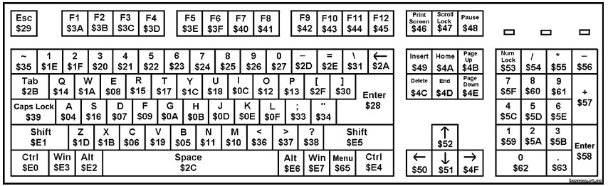

## Adding a keyboard layout

To add a keyboard layout, you must refer to this following picture (sourced from [this article from Vasily Rubashka, Ukraine , Sergey Shilov, Russia](https://www.mcselec.com/index.php?option=com_content&task=view&id=322)) to identify the keycode with the keys position.

Then:
1. define the __LOCALISE_xx__ layout constant (eg: `LOCALISE_FR` for French keyboard)
2. Update the `CMakeLists.txt` and append a new __picoterm_xx__ executable for the new layout (eg: `picoterm_FR`). Just follow the `picoterm_FR` as an example and repeat the operations.
3. Code a new section in the `pmhid.h` file for the new __LOCALISE_xx__ layout. This should be obvious.
4. `cmake ..` need to be issued once to be able to build the new executable __picoterm_xx__ .
5. From now, the picoterm can be compiled for the new layout with `make picoterm_xx` (eg: `make picoterm_FR`).

Voila!
