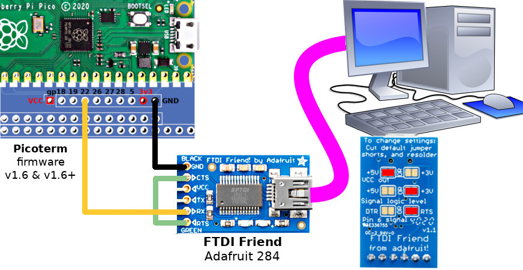
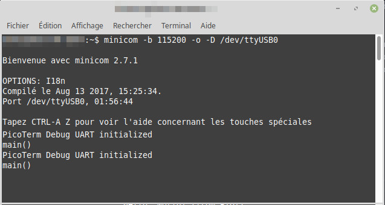

# Debuging PicoTerm

## Abstract

Usually the `printf()` statements are forwarded to default USB-Serial or uart0 (see
	definition for `pico_enable_stdio_usb` and `pico_enable_stdio_uart` used in CMakeList.txt).

The pitty is:
1. All uart0 position on the GPIO are used for VGA rendering
2. The USB is used for USB Host activities (so not available for USB-Serial activities)
3. Declaring `pico_enable_stdio_usb` will create compilation issue with tinyUSB (used for USB Host).

## A need for debugging

Presently, an already connected keyboard is not automatically detected when the Pico is power-up.

In such case, the keyboard must be unplug and plug again to make it detected properly by the code.

This have to be debugged (because this is ennoying) but how to do it when stdio is not avaiilable?

1. Use the SWD port + OpenOCD and DBG (the professional way)
2. __Adding a third uart__ on the Pico thanks to PIO then send debug string over him (the non-professional way)

_Remark:_ Trust it or not but I'm using a simple text editor and a command line to code, compile and test PicoTerm with my RC1024. So, using a second pico to connect SWD port + install OpenOCD + using DBG is just like using sledgehammer to kill a gnat! So I create a third uart (rx only) on my Pico!

## Wire it to your computer
We will use a FTDI Friend (Adafruit 284) to convert serial line (rx) to an USB-Serial.



## Reading the messages

Start a terminal on the USB-Serial connection of the FTDI Friend.

```
minicom -b 115200 -o -D /dev/ttyUSB0
```



And see the incoming messages when your PicoTerm starts:


## Curious?
If you want to know how it works, just check the source files:
* [uart_tx.pio](common/uart_tx.pio),
* [picoterm_debug.h](common/picoterm_debug.h),
* [picoterm_debug.c](common/picoterm_debug.c) .

Finally, just initialise the debug uart from `main()`` and then starts writing your messages:

```
int main(void) {
    debug_init(); // GPIO 28 as rx @ 115200
    debug_print( "main()" );
    ...
}
```

It is also possible to print-out formatted messages. the `picoterm_debug.h` have a `debug_msg`
buffer (100 char) that can be used with the `sprintf()` to format messages.

```
sprintf( debug_msg, "  magic_key=%s", c->magic_key );
debug_print( debug_msg );
sprintf( debug_msg, "  version=%u", c->version );
debug_print( debug_msg );
sprintf( debug_msg, "  colour_preference=%u", c->colour_preference );
debug_print( debug_msg );
```

__Remarks:__
* `debug_print()` will send a \r\n after each message.
* `debug_write()` just write the bytes (no \r\n added).
