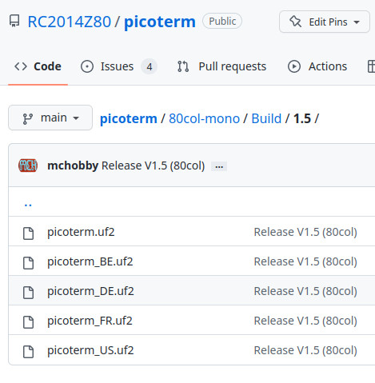
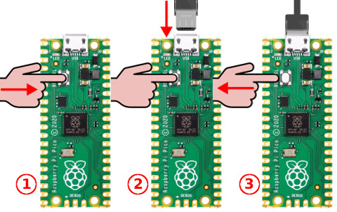
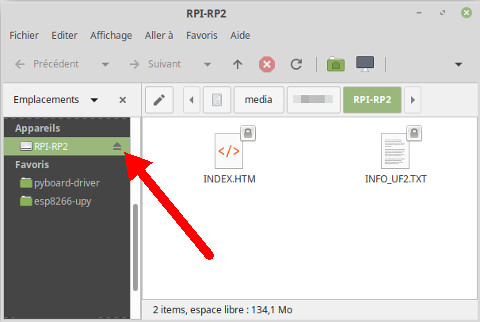
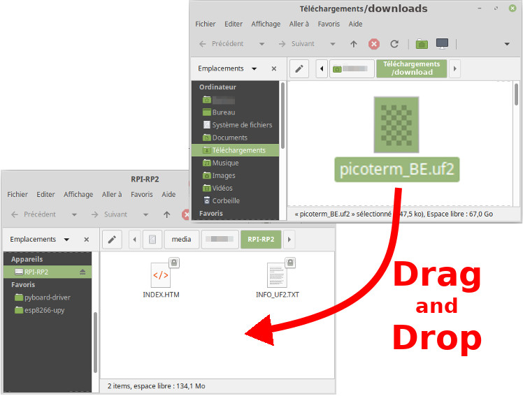

# Upgrade PicoTerm Firmware

It is quite easy to upgrade the PicoTerm firmware with a Linux/Windows/Mac computer.

The Pi Pico have an UF2 bootloader which appear as an USB mass storage device so you can drag'n'drop the firmware file to the board.

## Download the firmware

This repository contains various version of the PicoTerm firmware in the [/80col-mono/Build](../80col-mono/Build) and [/40col-color/Build](../40col-color/Build) folders.

Select the appropriate version as [detailled in the release notes](../releases.md) and download the corresponding `.uf2` file corresponding to your keyboard layout.

## Step 1: Power-Off the Pico

This look obvious but you will need to connect your Pico (and its PicoTerm board) onto the computer.

Prepare your USB câble and plug it onto your computer (do not plug the Pico side yet).

Power-off your project board, the __Raspberry-Pi Pico should be unpowered__.

## Step 2: Activating the bootloader

To activate the bootloader, the "bootsel" button must be pushed down while powering the Pico.

The Pico is now in bootloader mode and shows its Internal Flash Memory __as an USB-flash drive__.

__Using a RESET button to activate the bootloader:__ If your project board do have a Reset button (as the Picoterm board does, named RUN) then your can also activate the bootloader even when the board is already powered.
1. Press down the Reset button.
2. Press down the Bootsel button.
3. Release the Reset button first.
4. Release the Bootsel button in second

The board should now be in bootloader mode and appears as an USB Flash drive.

## Step 3: Copy the firmware to the Pico

Simply drag and drop the UF2 file from the download area onto you flash drive.

Wait a few second for the file-transfert to get terminated, the __boad will automatically restart__ when finished.

 Voilà, it is done.
