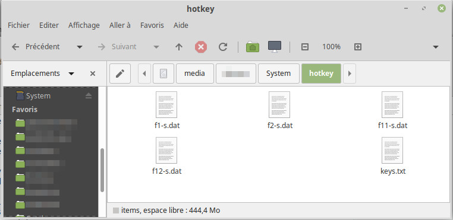

# Defining Hotkeys

HotKey or Shortcut key are Customised keyboard sequence associated to special key (like Shift+F1 or Ctrl+Shift+F2).

HotKey definition are stored on the SDCard into the folder **hotkey** !

## Which key ?

HotKey can be triggered either with Shift key either with Shift+Ctrl key.
They are both considered as two different hotkey.

* All function keys from F1 to F12.

## Hotkey file

Hotkeys are stored into the **hothey** folder of the SDCard.



The file name is structure as `<key>-<modifier>.dat` .

* <key>: identifies the key to pressed (in lower-case). Eg: from "f1" to "f12"
* <modifier>: the modifier keys that applies to the Hotkey.
 * use "s" for Shift,
 * use "sc" for Shift+Ctrl.

Examples:
* f1-s.dat : will be trigger with shift+F1
* f12-sc.dat : will be trigger with shift+ctrl+F12

**Tip:**

It may be useful to add a `keys.txt` file describing the action of keys. Here an example of mine.

```
Shift+F1 : A 8000
Shift+F2 : G 8000
Shift+F12 : Upload MemTest.hex @ 8000
Shift+F11 : Upload FC_Info.hex @ 8000
```

## Hotkey file content

The content of `.dat` file is sent as it to the host (over the serial port).

The shortkey `.dat` file contains either ASCII text, either an HEX data file (which is also text based data).

So, the way your computer encode the text file and encode line separator are very important!

On Windows machine, the line separator is CR\LF which may impact your host when sent. Note that Linux machine une LF and Mac machine uses CR.

Use an ASCII editor When editing file content. A text editor with Mac style line separator (\r) and character encoding compatible with ASCII (like "Windows-1250") can also be used.

On my Linux machine, I do use gedit and save the file with **character encoding compatible with ASCII** (Windows-1250 works pretty well) and with **Mac style line separator**.


**Tips:**

* When entering a SCM command into the dat file: add "Carriage Return" at the end of text to make it executed when the hotkey key is pressed.
* A [SCM-APPs HEX](https://smallcomputercentral.com/scm-apps/) file can also be renamed as hotkey key `.dat` filename (the app will be uploaded when pressing the shortcut key). The terminal will complains about commands but bytes will be loaded at the expected location ;-)
* Maintained `keys.txt` file can be read back with the `CLI` (see type command).
