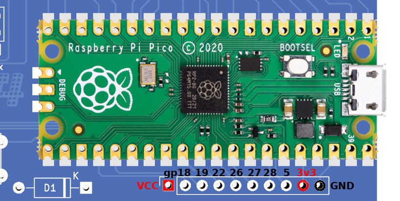
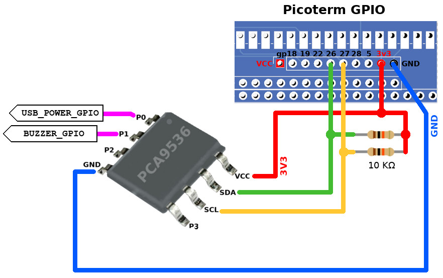
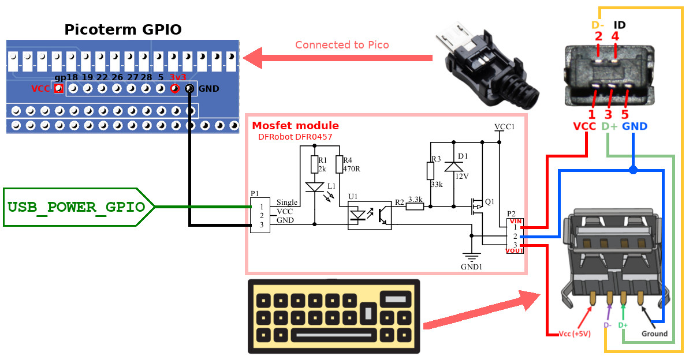
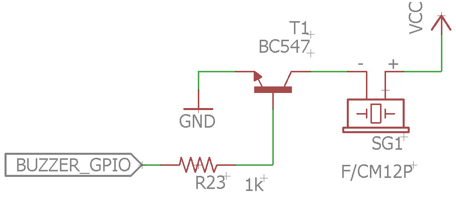

# Picoterm Expansion Connector - Firmware < 1.6

__All the GPIO assignation here below ONLY concern the FIRMWAREs STRICTLY BELOW 1.6.__

Firmware prior to 1.6 used different GPIO assignation on the expansion connector. Here are the corresponding description.

## Firmware PRIOR TO 1.6 expansion port GPIO assignation

The expansion connector is available just below the Pico.

| GPIO  | Description                                              |
|-------|----------------------------------------------------------|
| 18    | SD CMD = SPI_MOSI                                        |
| 19    | SD DAT0= SPI_MISO                                        |
| 5     | SD CLK = SPI_SCK                                         |
| 22    | SD DAT3/CD = SPI_CS                                      |
| 26    | I2C1 SDA (or GPIO for USB_POWER_GPIO)                    |
| 27    | I2C1 SCL (or GPIO for BUZZER_GPIO)                       |
| 28    | Poor man `debug_print()`. See [debug.md](debug.md) for details.  |

## GP26 & GP27: used as I2C or GPIOs

GP26 and GP27 can be used by PicoTerm either as GPIO, either as I2C bus (to connect I2C devices).

* __Used as I2C bus__: (Highly recommended) Picoterm can offers support for many additionnal features. The initial USB_POWER_GPIO and BUZZER_GPIO are then supported by the I2C GPIO Expander PCA9536 (see the PCA9536 wiring).
* __Used as GPIOs__: Picoterm can only support 2 additional features (USB_POWER_GPIO & BUZZER_GPIO). All other extended capabilites related to I2C bus will be disabled.

At startup, Picoterm initialize the I2C bus and tries to detect the PCA9536 GPIO expander. If the test fails, then the I2C bus is deinitialized and GP26 & 27 are reconfigured as output. The variable `i2c_bus_available` in `picoterm_i2c.c` is used to identify the availability of the I2C bus inside PicoTerm.

Depending on the GP26 & 27 mode, the Picoterm welcome screen will display either "Buzzer/USB Power __on GPIO__", either "Buzzer/USB Power __on I2C__".

If you don't want to use the I2C bus (really?) then you can use the following pin mapping.

| GPIO  | Description                                              |
|-------|----------------------------------------------------------|
| 26    | GPIO for USB_POWER_GPIO (I2C1 SDA not in use)            |
| 27    | GPIO for BUZZER_GPIO (I2C1 SCL not in use)               |

## Adding GPIO Expander (PCA9536)

The PCA9536 will allows us to add 4 controlable GPIOs over the I2C bus. This will allow the control the `USB_POWER_GPIO` and `BUZZER_GPIO` without sacrifying the I2C capabilities.

| IO   | Description                                              |
|------|----------------------------------------------------------|
| IO_0 | Activate the USB Type A power (USB_POWER_GPIO)           |
| IO_1 | Switch on the active buzzer (BUZZER_GPIO)                |
| IO_2 | _Not allocated yet!_                                     |
| IO_3 | _Not allocated yet!_                                     |

## Wiring USB-A with delayed Power-Up

Delaying the USB keyboard power up solved the keyboard detection at startup.

Here is a self-made connector created for testing purpose.

List of material:
* [Gravity: MOSFET Power Controller](https://www.dfrobot.com/product-1567.html) @ DFRobot
* [USB DIY Connector Shell - Type Micro-B Plug](https://www.adafruit.com/product/1390) @ adafruit
* [USB-A (USB TYPE-A) Receptacle Connector](https://www.digikey.be/nl/products/detail/on-shore-technology-inc/USB-A1HSW6/2677750) @ DigiKey

## Piezo Buzzer

In the future, the buzzer will be controlled via an I2C GPIO expander. For this reason, it must be an active buzzer because Pico will not feed it with PWM signal!

__Under construction__

List of material:
* [Active Piezo Buzzer](https://www.adafruit.com/product/1536) @ Adafruit - indicating as working at 5V & 3.3V
* BC547
* R1K
