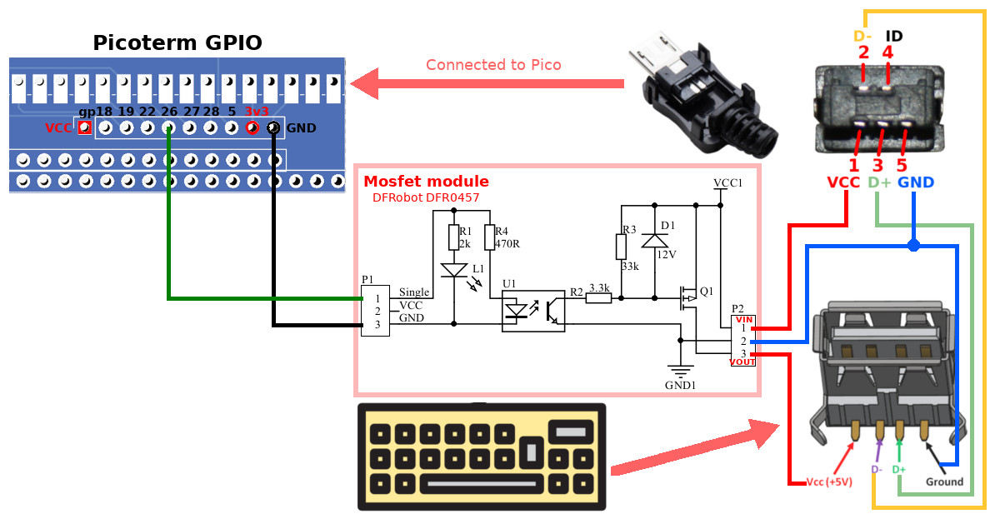

# Picoterm Expansion Connector

The expansion connector is available just below the Pico.

| GPIO  | Description                                              |
|-------|----------------------------------------------------------|
| 18    | SD CMD = SPI_MOSI                                        |
| 19    | SD DAT0= SPI_MISO                                        |
| 5     | SD CLK = SPI_SCK                                         |
| 22    | SD DAT3/CD = SPI_CS                                      |
| 26    | I2C1 SDA (temporarily used for USB power-Up)             |
| 27    | I2C1 SCL (temporarily used for active Buzzer, Adafruit 1536)     |
| 28    | Poor man `debug_print()`. See [debug.md](debug.md) for details.  |

## Wiring USB-A with delayed Power-Up

Delaying the USB keyboard power up solved the keyboard detection at startup.

Here is a self-made connector created for testing purpose.

List of material:
* [Gravity: MOSFET Power Controller](https://www.dfrobot.com/product-1567.html) @ DFRobot
* [USB DIY Connector Shell - Type Micro-B Plug](https://www.adafruit.com/product/1390) @ adafruit
* [USB-A (USB TYPE-A) Receptacle Connector](https://www.digikey.be/nl/products/detail/on-shore-technology-inc/USB-A1HSW6/2677750) @ DigiKey

## Piezo Buzzer

In the future, the buzzer will be controlled via an I2C GPIO expander. For this reason, it must be an active buzzer because Pico will not feed it with PWM signal!

__Under construction__

List of material:
* [Active Piezo Buzzer](https://www.adafruit.com/product/1536) @ Adafruit - indicating as working at 5V & 3.3V
* BC547
* R1K 
