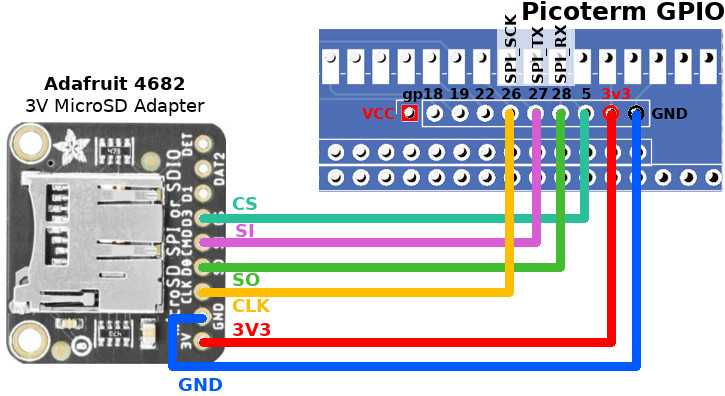

# Picoterm Expansion Connector

__All the GPIO assignation here below ONLY APPLIED FROM FIRMWARE 1.6.__ for previous firmware version check [this document version](picoterm-conn-hr10.md).

From firmware 1.6, expansion port GPIO complies with a newer I/O assignation for SDCard, Buzzer, USB-A Power-Up. If you do use such features, just move your connexions around the expansion port.

The newer [RP2040 VGA Terminal](https://z80kits.com/shop/rp2040-vga-terminal/) board do already implement all the hardware. It still breakout the various signals to its expansion connector.

Extra features can be implemented on the initial [RC2014 Pi Pico VGA Terminal](https://z80kits.com/shop/rc2014-pi-pico-vga-terminal/) by doing appropriate connexions on the expansion port.

## Firmware 1.6 expansion port GPIO assignation

The expansion connector is available just below the Pico and can be used to connect additionnal hardware.

On the RP2040 VGA Terminal, the connector is also available and hardware (sdcard, USB-Power, ....) are already connected on it.

| GPIO  | Description                                              |
|-------|----------------------------------------------------------|
| 27    | SD CMD = SPI_MOSI / SPI_TX                               |
| 28    | SD DAT0= SPI_MISO / SPI_RX                               |
| 26    | SD CLK = SPI_SCK                                         |
| 5     | SD DAT3/CD = SPI_CS                                      |
| 18    | I2C1 SDA (or GPIO for USB_POWER_GPIO)                    |
| 19    | I2C1 SCL (or GPIO for BUZZER_GPIO)                       |
| 22    | Poor man `debug_print()`. See [debug.md](debug.md) for details.  |

## GP18 & GP19: used as I2C or GPIOs

GP18 and GP19 can be used by PicoTerm either as GPIO, either as I2C bus (to connect I2C devices).

* __Used as I2C bus__: (as used RP2040 VGA Terminal) Picoterm can offers support for many additionnal features. The initial USB_POWER_GPIO and BUZZER_GPIO are then supported by the I2C GPIO Expander PCA9536 (see the PCA9536 wiring).
* __Used as GPIOs__: Picoterm can only support 2 additional features (USB_POWER_GPIO & BUZZER_GPIO). All other extended capabilites related to I2C bus will be disabled.

At startup, Picoterm initialize the I2C bus and tries to detect the PCA9536 GPIO expander. If the test fails, then the I2C bus is deinitialized and GP18 & 19 are reconfigured as output. The variable `i2c_bus_available` in `picoterm_i2c.c` is used to identify the availability of the I2C bus inside PicoTerm.

Depending on the GP18 & 19 mode, the Picoterm welcome screen will display either "Buzzer/USB Power __on GPIO__", either "Buzzer/USB Power __on I2C__".

If you don't want to use the I2C bus (really?) then you can use the following pin mapping.

| GPIO  | Description                                              |
|-------|----------------------------------------------------------|
| 18    | GPIO for USB_POWER_GPIO (I2C1 SDA not in use)            |
| 19    | GPIO for BUZZER_GPIO (I2C1 SCL not in use)               |

## Adding GPIO Expander (PCA9536)

The PCA9536 will allows us to add 4 controlable GPIOs over the I2C bus. This will allow the control the `USB_POWER_GPIO` and `BUZZER_GPIO` without sacrifying the I2C capabilities.

| IO   | Description                                              |
|------|----------------------------------------------------------|
| IO_0 | Activate the USB Type A power (USB_POWER_GPIO)           |
| IO_1 | Switch on the active buzzer (BUZZER_GPIO)                |
| IO_2 | _Not allocated yet! Known as 102 on [RP2040 VGA Terminal](https://z80kits.com/shop/rp2040-vga-terminal/) connector_                 |
| IO_3 | _Not allocated yet! Known as 103 on [RP2040 VGA Terminal](https://z80kits.com/shop/rp2040-vga-terminal/) connector_                 |

## Wiring USB-A with delayed Power-Up

Delaying the USB keyboard power up solved the keyboard detection at startup.

Here is a self-made connector created for testing purpose.

List of material:
* [Gravity: MOSFET Power Controller](https://www.dfrobot.com/product-1567.html) @ DFRobot
* [USB DIY Connector Shell - Type Micro-B Plug](https://www.adafruit.com/product/1390) @ adafruit
* [USB-A (USB TYPE-A) Receptacle Connector](https://www.digikey.be/nl/products/detail/on-shore-technology-inc/USB-A1HSW6/2677750) @ DigiKey

## Piezo Buzzer

The buzzer is controlled via an I2C GPIO expander. For that reason, it must be an active buzzer (produce sound as soon as power is applied to it).

List of material:
* [Active Piezo Buzzer](https://www.adafruit.com/product/1536) @ Adafruit - indicating as working at 5V & 3.3V
* BC547
* R1K

## Wiring SDCard

Thanks to fatfs over PIO SPI (emulation of SPI bus) the picoterm is now able to mount a FAT & FAT32 SDCard.

List of material:
* [3V MicroSD Adapter](https://shop.mchobby.be/fr/cartes-breakout/2049-adaptateur-micro-sd-version-3v-3232100020498-adafruit.html) @ MC Hobby
* [3V MicroSD Adapter](https://www.adafruit.com/product/4682) @ Adafruit

## Poor Man debugger

Using the poor-man debugger gpio is described into the [debug.md](debug.md) document.
