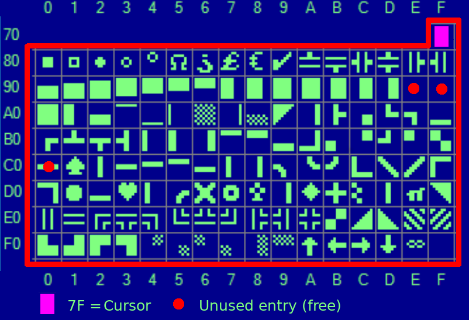

# Using NuPetScii charset

The following examples can be assembled into the RC2014 monitor to test NupetScii (graphical) capabilities.

# From RC2014 monitor

The following examples uses the API $02 to display a character on the terminal.

## Normal ASCII display

This example display the character 0x90 on the terminal. This appears as a __REVERSE__ "1".

```
a 8000

ld a, $90 ; Reverse 1 char
ld c, $02 ; API 2 - write char
rst 30    ; API call
ret       ; return to monitor
```

## NuPetScii display

Switch to graphical charset (NuPetScii) with "ESCAPE F" this display the caracter 0x90.

This time, the 0x90 will appears as a partial filled square.



```
a 8000

ld a, $1B ; Switch NuPetSCII
ld c, $02 ;
rst 30    ; API call - Send ESC
ld a, 'F'
rst 30    ; Send F
ld a, $90
rst 30    ; Send char 0x90
ret       ; return to monitor
```

## Switch back to ASCII

Just send ESC G to switch back to VT100 ASCII charset.

```
a 8000

ld a, $1B ; Switch to ASCII
ld c, $02 ;
rst 30    ; API call - Send ESC
ld a, 'G'
rst 30    ; API call - Send G
```
