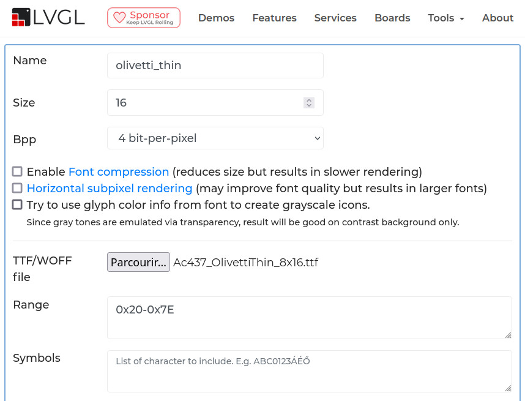

# Adding Font-Face for for PicoTerm

This following roadmap explains the various steps used to add a new font-face into PicoTerm (like we do for "[Olivetti Thin](olivetti_thin.readme)" font. Click the link fpr credit.)

## 1) Getting the font

The first operation is to get the TTF font.

Font must have 15 pixels high at the most. The selected font will have 14 lines height (as we will see in the .line_height property of the generated c file).

As already stated, we will download the `Ac437_OlivettiThin_8x16.tff` (see direct link https://int10h.org/oldschool-pc-fonts/fontlist/?2#olivetti ).

## 2) Convert TTF to C file

Now we will use the LVGL online fontconverter to convert the TTF file to C [https://lvgl.io/tools/fontconverter](https://lvgl.io/tools/fontconverter) .

Here the parameter used:
* __name__: `olivetti_thin` (will be the C filename and `lv_font_t` object name)
* __size__: 16px as stated in ttf font name.
* __Bpp__ : 4 bit per pixels
* __TTF/WOFF__ : select the downloaded `Ac437_OlivettiThin_8x16.tff` font.
* __Range__ : only keeps the chars 0x20 to 0x7E (like in the original picoterm font8.c)

Click the [Convert] button.
* That will generates and download the `olivetti_thin.c`
* __DO NOT SAVE__ this `olivetti_thin.c` in the source code __BUT__ open it into a text editor (we will use it as a refence).

## 3) Prepare the furur c file

copy the `/font-suite/font8.c` and name it `/font-suite/olivetti_thin.c`.

Open this new `/font-suite/olivetti_thin.c` in your code editor.

## 4) Merging files

We will now merge the __downloaded__ `olivetti_thin.c` into the __created__ `font-suite/olivetti_thin.c`.

As type declaration are not identical between the file, we will merge the content manually.

Carefully replace the following sections of `font-suite/olivetti_thin.c` with the definition of the __downloaded__ `olivetti_thin.c`:
* Update the __#define__ statements with the appropriate `OLIVETTI_THIN`
* Replace the data (only the data) in the __BITMAP__ section
* Replace the data in the the __GLYPH DESCRIPTION__ section
* Update the data in the __CHARACTER MAPPING__ section
* Update the data in the __ALL CUSTOM DATA__ section
* Update the data in the __PUBLIC FONT__
 * set the `lv_font_t` structure name to `olivetti_thin`
 * update the `.font_height` accordinly
 * update the `.baseline` accordingly

## 5) Compile_font.py : merging font + charset

Open the `font-suite/compile_font.py` .

In the "__ __ main __ __" section of the script, add the required intructions to combine `font-suite/olivetti_thin.c` with the available charsets (actually `cp437.data` and `nupetscii.data`).

This will creates the files `font-suite/olivetti_thin_cp437.c` and `font-suite/olivetti_thin_nupetscii.c`.

## 6) Compiling the new font in picoterm

* Update `CMakeLists.txt`:
 * copy the `olivetti_thin_*.c` files to sources directory.
 * append the `olivetti_thin_*.c` files to the source to be compiled (look for `list( APPEND sources`).
* update `main.c` to add __extern__ declararation the `extern const lv_font_t nupetscii_olivetti_thin;` and `cp437_olivetti_thin` too.
* update `common/picoterm_stddef.h` and `.c` files to add the new font.
* update the various sources files follow the __FONT_NUPETSCII_MONO8__ to identifies the place to update the code. Following files may be touched:
 * main.c
 * `picoterm_conio.c` (`print_nupet()`)
 * `picoterm_screen.c` (configuration screen)
 * `common/picoterm_cursor.c`
 * `common/picoterm_dec.c` (DEC line drawing)
