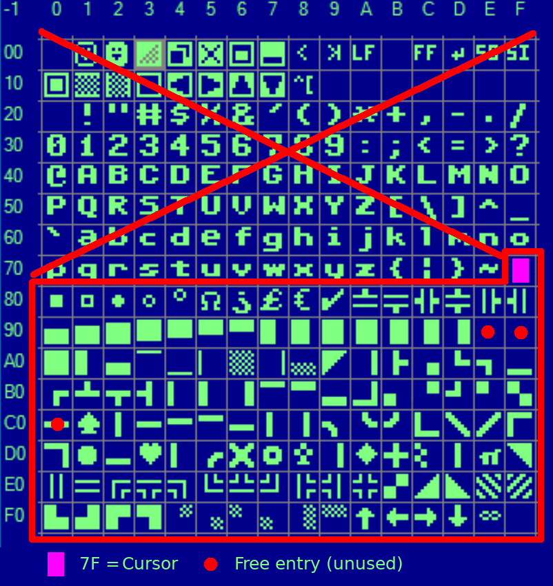
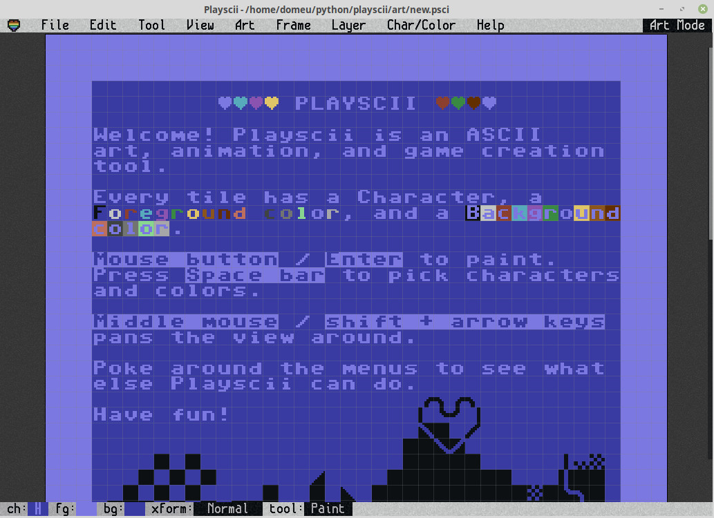
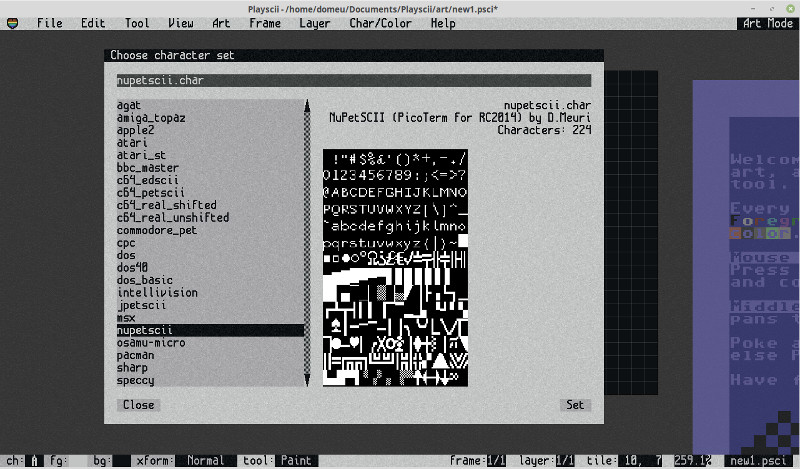
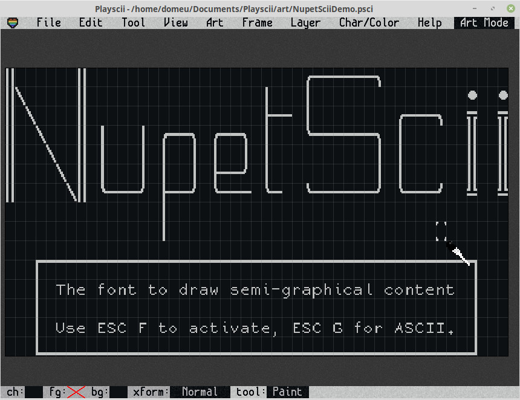
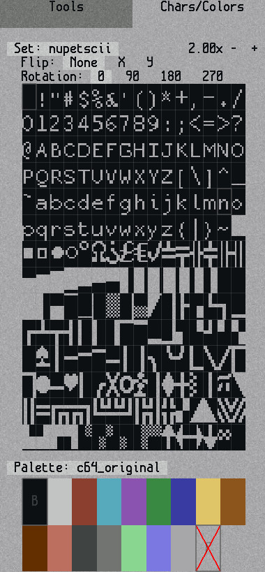
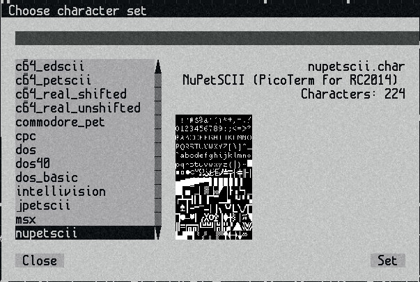
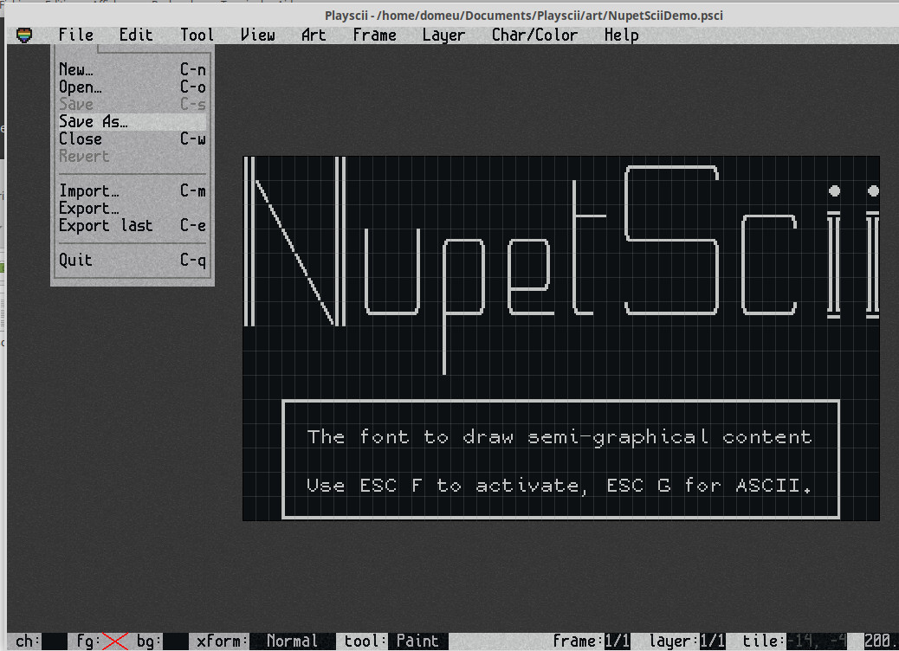
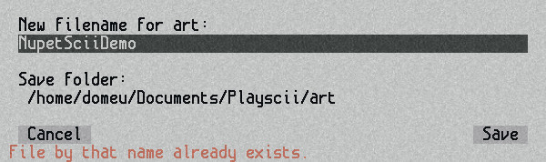
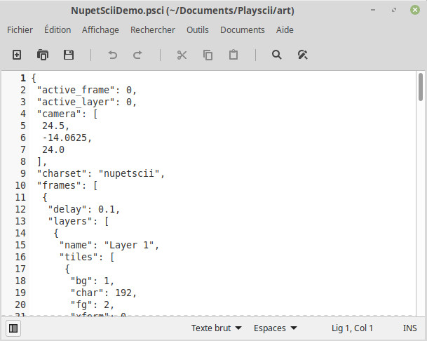

# NuPetSCII - Expanding the font8.c with glyphs

The `font8.c` used in the original PicoTerm 80 column only defines the ASCII charset
(from 0 to 126. 127 is use for cursor display).

`font8.c` leaks of of nice graphical interface (like Commodore 64 or Code Page 437 do have).

Extending ASCII charset would be a great idea to draw ASCII tables and rudimentary interface.

It is even possible to draw screen and maps by using the Playscii software (see further).

## NuPETSCII - ASCII charset for C256 Foenix

Here are the additionnal chars merged into the `font8.c` file.



```
font8.c + nupet-ascii.data ---( compile_font.py )---> nupetscii.c
```

## Credit
I discovered the NuPET font/charset designed by Tom Wilson on this [Stefany Allaire article](https://stefanyallaire.wixsite.com/website/forum/the-specifications/character-sets).

Tom did use its own [Character-Editor](https://github.com/tomxp411/Character-Editor) to design the NuPET ASCII charset (and many other). [Character-Editor](https://github.com/tomxp411/Character-Editor) is a ¢# opensource projet written available on GitHub.

Tom Wilson gracefuly authorise the usage of its NuPet font design in PicoTerm. Thanks to him for its sharing.

# Drawing/Art with NuPetScii

If you want to draw screen or art with NuPetScii, you can use the [Playscii from JP Lebreton](https://jp.itch.io/playscii), an open-source software written in Python3.

This software can be used on Windows, Mac and Linux. Linux version runs directly from source code.

<small><br/>Credit: [Playscii by JP Lebreton](https://jp.itch.io/playscii)</small>

## Ressources
* [Playscii by JP Lebreton](https://jp.itch.io/playscii)
* [NupetScii charset for Playscii](nupetscii-for-playscii.zip) (zip file)

## Add NuPetScii font to Playscii software

Some efforts have been made to create the NuPetSCII charset to create ressources with Playscii + NupetSCII.

 The current folder contains the [nupetscii-for-playscii.zip](nupetscii-for-playscii.zip) used to add NuPetScii font to PlayScii.

After installation of Playscii:
1. open the [nupetscii-for-playscii.zip](nupetscii-for-playscii.zip) archive.
2. extract the `nupetscii.char` and `nupetscii.png` files from the archive.
3. copy the files in the `/charsets` folder of Playscii software.

You can check that font is proprely installed by selecting the menu entry "char/color | Choose character set..." in the Playscii software.



## Create a NuPetScii art with Playscii Software

Playscii is a great Python software to create ASCII based ressource/art.

Here is the [docs/NupetSciiDemo.psci](../docs/docs/NupetSciiDemo.psci) 49 x 15 art created with PlayScii.



The SPACEBAR is used to display/hide the toolbox.



In the toolbox, click on the "__Set__" to select the "__nupetscii__" character set.

<div style="border:solid blue; padding: 10px">

Remark:<br />The "__Palette__" option stays on "__c64_original__".<br />The color data is currently not used as Picoterm display monochrom content.</div>



When finished, select the menu "File | Save as".



And give a name to your file. It will be saved with the `.psci` extension.



Checking the psci file content reveal a storage format based on JSON. The format is quite simple and straightforward.



* The file contains __frames__
* Each __frame__ contains __layers__
* Each __layer__ contains __tiles__
* Each __tile__ being a char (index in the charset) with additionnal properties.

So, accessing the characters/tiles of our 49 x 15 art is done with the following python expression (where `data` contains the loaded JSON).

```
screen = data['frames'][0]['layers'][0]['tiles']
```

## Converting NupetScii to Raw & Hex

The [psci-extract.py](psci-extract.py) python script can be used to convert the Playscii file to something more appropriate for the RC2014 computer (or SCM).

```
== PlayScii extractor 0.1 ==
Extract RC2014 data from art/screen drawed with playscii
                  by Meurisse D.
USAGE:
  ./psci-extract.py <filename.psci> -r -h

<filename>  : the PlayScii saved file
-r          : Create the .raw binary file (see description here below).
-hex <addr> : Create an Intel Hex file to store the raw data from
              the given address (integer or hexadecimal like 0x8100).
-h          : display this help.

=== .raw format ===
W : 1 byte, column Width
H : 1 byte, row Height
Data: column*row continuous bytes, Art/Screen data from row[1] to row[H].
Each row having W bytes (1 byte per column).
```

The following command creates the raw file with the data (see description here upper). This binary file can be very useful to store data onto the file system in a simple format (eg: CP/M).

```
python psci-extract.py ../docs/NupetSciiDemo.psci -r
```

You can check the [NupetSciiDemo.raw](../docs/NupetSciiDemo.raw) file with an Hex Editor (the file is stored into the docs folder).


The following command create a HEX file (that can be uploaded to SCM) and store the data at a given address (0x8500 in the following example).

```
$ ./psci-extract.py ../docs/NupetSciiDemo.psci -hex 0x8500
NupetSciiDemo.psci to RC20214 SCM hex
source    : ../docs/NupetSciiDemo.psci
charset   : nupetscii
palette   : c64_original
size      : 49 x 15
layer name: Layer 1
data size : 737 bytes
target addr: 34048
file created @ ../docs/NupetSciiDemo.hex
```

You can check the [NupetSciiDemo.hex](../docs/NupetSciiDemo.hex) file stored into the docs folder.

# Activating NuPetScii with Escape Sequence

NuPetScii can be activated from PicoTerm menu and with [ESC sequence (see README.md)](../README.md). So an application can request the terminal to switch to semi-graphical font (AKA NuPetScii) when needed.

See the examples described in the "[using-nupetscii.md](../docs/using-nupetscii.md)" document for more details.

# About nupetscii.data used to create the font

The file `nupetscii.data` contains the definition of the additional chars. This file will be compiled with the `compile_font.py` python script to generate the expanded font charset named `nupetscii.c` .

`nupetscii.c` is the font file included within the PicoTerm sources.

Characters have the size of:
* 12px height * 8px wide (normal height)
* 15px height * 8px wide (extra height)

The char here below is the biggest possible.

``` c
/* U+7F DEL=Frame (128) */
{.bitmap_index = @bitmap_index@, .adv_w = 128, .box_h = 15, .box_w = 8, .ofs_x = 0, .ofs_y = -3}
FFFFFFFF
F......F
F......F
F......F
F......F
F......F
F......F
F......F
F......F
F......F
F......F
F......F
F......F
F......F
FFFFFFFF
```

Y offet start at the bottom of char (the baseline). Descending chars like p,q use negative offset to properly align the char on the baseline.

The font can have 15 row height at the maximum with a descending offset of 3 pixels (-3). Normal characters (limited to the baseline) do makes 12 rows.

The original font is coded with 4 bit per pixel (4 bpp), so with values from 0 to F for each point.

The hexadecimal notation (0 to F) are used in the data file (one letter for each 4bpp entry)!

The dot is used inplace of "0" to improve the readability.
