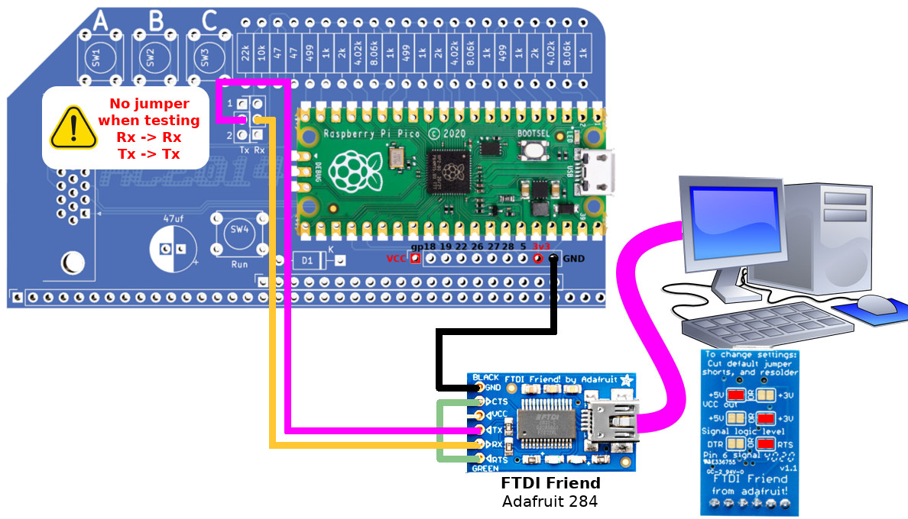

# Testing escape sequence

This section contains python3 code used to test specific escape sequence by
connecting a computer to the RX pin of PicoTerm board.

Python code establish a serial connexion @ 115200 bauds 8N1 (RC2014/Picoterm default).



The `test_esc.py` script is created to ease the repetitive testing. Just start-it and gives the name of the test to be perform.

call the `lorem` to fill the terminal with text.

## How it works

Just start the python script with `python3 test_esc.py /dev/ttyUSB0` where `/dev/ttyUSB0` is the serial line connected to the PicoTerm.

Key-in the name of the test to start it. The computer screen shows the executed test and its description (as encoded into the docstring).

Here a capture of a small test session.

```
$ ./test_esc.py /dev/ttyUSB0
== PicoTerm Escape Sequence tester 0.1 ==
Series of test to call on demand to check specific escape sequence handling on PicoTerm.

type test name to execute it or exit to quit!
test names: nupetscii, ascii, lorem, clearscr

Which test? lorem
Run: lorem
Send several paragraphs of Lorem Ipsum

Which test? clearscr
Run: clearscr
Fill screen with content, then clear it from cursor to end of screen

Which test?
```

## How to add a test

1. open the `test_esc.py` script
2. find the `if __name__ == '__main__':` at the end of the script.
3. make some room before the `if` statement to append a new function.
4. add a new test (eg: `tralala`) by declaring the test function (eg: `test_tralala`) as described here below.

``` python
def test_tralala( ser ):
	""" Fill screen with content, then clear it from cursor to end of screen"""
	ser.write_str( "Here is some text\r\nwhich is displayed on the screen\r\nbefore applying escape sequence" )
	ser.write_str( "\ESC[H" ) # move cursor to 0,0
	ser.write_str( "\ESC[0J" ) # clear from cursor to end of screen
```

## Available methods

The `ser` (of type `SerialHelper`) expose some method to helps test writing.
* __write_str( str )__ : send the string over the serial by replacing some mnemonic (like \ESC).
* __write_byte( value )__ : send a single byte value (as numeric) to picoTerm.

See the methods availables on `SerialHelper` for more.
